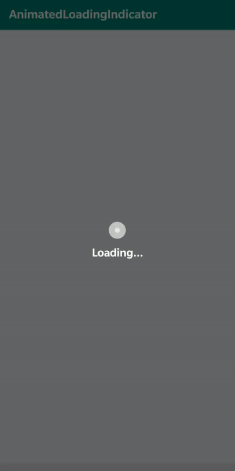

# AnimatedLoadingIndicator

[](https://jitpack.io/#yash786agg/AnimatedLoadingIndicator)

#### LoadingIndicator

This is a simple but effective animated Loading Indicator which can easily ready to use integrated few lines of code.

# Android SDK version Support:
* __Minimum SDK version is: 15__
* __Maximum SDK version is: 29__

# Demo


#### Android Gradle

LoadingIndicator library Installation 

```groovy
// Add it in your root build.gradle at the end of repositories:
allprojects {
		repositories {
			...
			maven { url 'https://jitpack.io' }
		}
	}
```

```groovy
// Add AnimatedLoadingIndicator dependency
dependencies {
	        implementation 'com.github.yash786agg:AnimatedLoadingIndicator:v1.3'
	}
```

#### Code to add in your project file for Kotlin User

// Adding Progress Dialog
```groovy
val progressDialog = Dialog(this)
progressDialog.requestWindowFeature(Window.FEATURE_NO_TITLE)
progressDialog.setContentView(R.layout.custom_dialog_progress)

/* Custom setting to change TextView text,Color and Text Size according to your Preference*/

val progressTv = progressDialog.findViewById(R.id.progress_tv) as TextView
progressTv.text = resources.getString(R.string.loading) 
progressTv.setTextColor(ContextCompat.getColor(this, R.color.colorAccent))
progressTv.textSize = 19F

progressDialog.window!!.setBackgroundDrawable(ColorDrawable(Color.TRANSPARENT))
progressDialog.setCancelable(false)
progressDialog.show()
```

// Dismiss Progress Dialog
```groovy
progressDialog.dismiss()
   or
progressDialog.cancel()
```

#### Code to add in your project file for Java User

// Adding Progress Dialog
```groovy
Dialog progressDialog = new Dialog(this);
progressDialog.requestWindowFeature(Window.FEATURE_NO_TITLE);
progressDialog.setContentView(R.layout.custom_dialog_progress);

/* Custom setting to change TextView text,Color and Text Size according to your Preference*/

TextView progressTv = progressDialog.findViewById(R.id.progress_tv);
progressTv.setText(getResources().getString(R.string.loading));
progressTv.setTextColor(ContextCompat.getColor(this, R.color.colorAccent));
progressTv.setTextSize(19F);
if(progressDialog.getWindow() != null)
    progressDialog.getWindow().setBackgroundDrawable(new ColorDrawable(android.graphics.Color.TRANSPARENT));        

progressDialog.setCancelable(false);
progressDialog.show();
```
// Dismiss Progress Dialog
```groovy
progressDialog.dismiss();
   or
progressDialog.cancel();
```

# Prerequisites
* __Android Studio 3.4__
* __Gradle version 3.4.2__
* __Android Device with USB Debugging Enabled__

# Built With

* __[Android Studio](https://developer.android.com/studio/index.html)__ - The Official IDE for Android
* __[Gradle](https://gradle.org)__ - Build tool for Android Studio

Thanks for reading this repo. Be sure to click ★ below to recommend this repo if you found it helpful. It means a lot to me.

For more about programming, follow me on [Medium](https://medium.com/@yash786agg)

Also, Let’s become friends on [Linkedin](http://bit.ly/24t4EVI)
